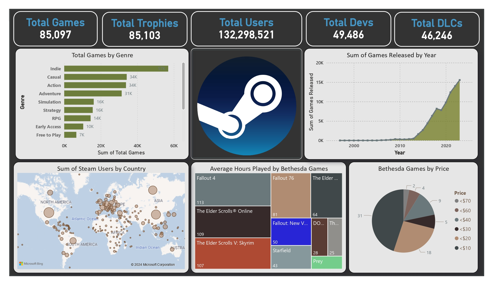

# Steam Games Statistics Analysis Project

This project analyzes Steam games with focus on Bethesda Games using SQL and Power BI.

## An image of the Power BI visualization.

## Project Structure

- **SQL**: Contains the main SQL script for the generated queries.
- **PowerBI**: Contains the Power BI project fill.
- **Data**: Contains sample data in CSV format for demonstration purposes.

## Queries

- The SQL queries used for generating visualizations in Power BI are in `SQL/queries.sql`.

## Contact

For any questions or suggestions, please contact [jasonfaeq@gmail.com](mailto:jasonfaeq@gmail.com).
